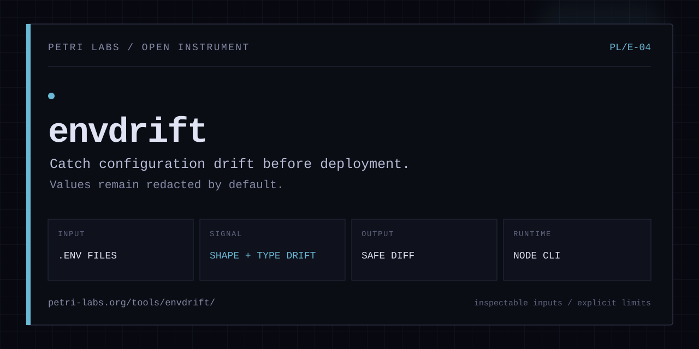

<p align="center">
  
</p>

<p align="center">
  <a href="https://www.npmjs.com/package/@barissozudogru/envdrift"></a>
  <a href="https://www.npmjs.com/package/@barissozudogru/envdrift"></a>
  <a href="https://github.com/barissozudogru/envdrift/actions/workflows/ci.yml"></a>
  <a href="./LICENSE"></a>
</p>

# envdrift

Detect environment variable drift across your .env files before it causes production bugs.

envdrift compares two or more `.env` files and surfaces keys that are missing in some environments, values whose inferred types differ across files, and values that look like placeholders or contain protocol mismatches. It is designed to be used as a local check, a pre-commit hook, or a CI step that fails the build when drift is detected.

[Tool page](https://petri-labs.org/tools/envdrift/) · [npm](https://www.npmjs.com/package/@barissozudogru/envdrift) · [Source](https://github.com/barissozudogru/envdrift)

---

## Installation

Install globally:

```bash
npm install -g @barissozudogru/envdrift
```

Or run without installing:

```bash
npx @barissozudogru/envdrift .env .env.staging .env.production
```

---

## Usage

### Auto-detect

Run in any project directory and envdrift will pick up all `.env*` files automatically:

```bash
cd /your/project
envdrift
```

### Explicit files

```bash
envdrift .env .env.staging .env.production
```

### JSON output for CI pipelines

```bash
envdrift --json .env .env.production
```

### Ignore specific keys

```bash
envdrift --ignore SECRET_KEY,INTERNAL_TOKEN .env .env.production
envdrift --ignore SECRET_KEY --ignore INTERNAL_TOKEN .env .env.production
```

---

## Options

| Flag | Short | Description |
|---|---|---|
| `--help` | `-h` | Show help message |
| `--version` | `-v` | Show version number |
| `--json` | | Output results as JSON |
| `--ignore <keys>` | `-i` | Comma-separated keys to exclude from comparison. Can be repeated. |
| `--show-values` | | Print raw values instead of their shape. Not for CI, see Value redaction below. |

---

## Example Output

```
envdrift - environment drift report
──────────────────────────────────────────────────

Comparing files:
  • .env.development
  • .env.production

MISSING KEYS  (2)
──────────────────────────────────────────────────
  x STRIPE_WEBHOOK_SECRET
    present in:   .env.production
    missing from: .env.development

  x REDIS_URL
    present in:   .env.development, .env.production
    missing from: .env.staging

TYPE MISMATCHES  (1)
──────────────────────────────────────────────────
  ! MAX_CONNECTIONS
    .env.development: number
    .env.production: string

VALUE ANOMALIES  (2)
──────────────────────────────────────────────────
  ~ DATABASE_URL  Placeholder value detected in .env.development
    .env.development: 22 chars, ascii, #b310
    .env.production: 44 chars, url, #7c02

  ~ API_ENDPOINT  Protocol mismatch across files (http: vs https:)
    .env.development: 31 chars, url, #4ae1
    .env.production: 23 chars, url, #90d5

Summary: 2 missing  1 type mismatch  2 anomalies
```

If this saves you time, consider [starring the repository](https://github.com/barissozudogru/envdrift). It helps other developers find it.

---

## Value redaction

envdrift reads `.env` files, which routinely hold live credentials. It never prints a value.
Each value is described instead: length, character class, and a short stable fingerprint.

```
API_FOOTBALL_KEY
  .env: 32 chars, hex, #fa98
  .env.example: 9 chars, token, #442c
```

The fingerprint is what keeps the report useful. Identical values fingerprint identically, so
you can still tell at a glance whether two environments hold the same value, without the value
appearing anywhere.

This matters most in CI. Values registered as CI secrets are masked in build logs, but values
read from a file on disk are not, so anything printed lands in the log in cleartext.

`--show-values` prints raw values for local debugging. Do not use it in CI.

---

## CI Integration

### GitHub Actions

```yaml
name: Check env drift

on: [pull_request]

jobs:
  env-drift:
    runs-on: ubuntu-latest
    permissions:
      contents: read
    steps:
      - uses: actions/checkout@v4
      - uses: barissozudogru/envdrift@v0.5.0
        with:
          files: .env.example .env.ci
```

The action writes the redacted report to the workflow summary and preserves the CLI exit code. It never enables `--show-values`.

### Pre-commit hook

Add to `.git/hooks/pre-commit`:

```bash
#!/bin/sh
npx @barissozudogru/envdrift .env.example .env
if [ $? -ne 0 ]; then
  echo "Env drift detected. Fix before committing."
  exit 1
fi
```

---

## Exit Codes

| Code | Meaning |
|---|---|
| `0` | No drift detected, all files are in sync |
| `1` | Drift detected or an error occurred |

---

## Programmatic API

```typescript
import { compareEnvFiles, parseEnvFile, inferType } from "@barissozudogru/envdrift";

const result = compareEnvFiles([".env", ".env.production"]);

if (!result.clean) {
  console.log("Missing keys:", result.missingKeys);
  console.log("Type mismatches:", result.typeMismatches);
  console.log("Value anomalies:", result.valueAnomalies);
}
```

### `parseEnvFile(path: string): EnvMap`

Parses a `.env` file into a key-value map. Handles comments, blank lines, quoted values, inline comments, `export` prefixes, and multiline double-quoted values.

### `inferType(value: string): ValueType`

Infers the semantic type of a value. Returns one of: `"boolean"`, `"number"`, `"url"`, `"path"`, `"string"`.

### `compareEnvFiles(files: string[], ignoreKeys?: string[]): DriftResult`

Compares all provided files and returns a structured result:

```typescript
interface DriftResult {
  files: string[];
  missingKeys: MissingKey[];
  typeMismatches: TypeMismatch[];
  valueAnomalies: ValueAnomaly[];
  clean: boolean;
}
```

---

## License

[MIT](./LICENSE)
